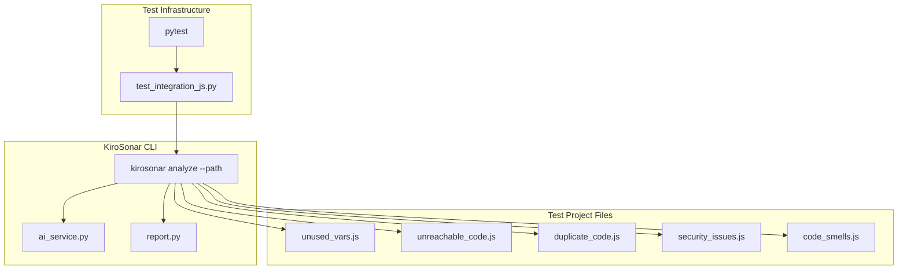
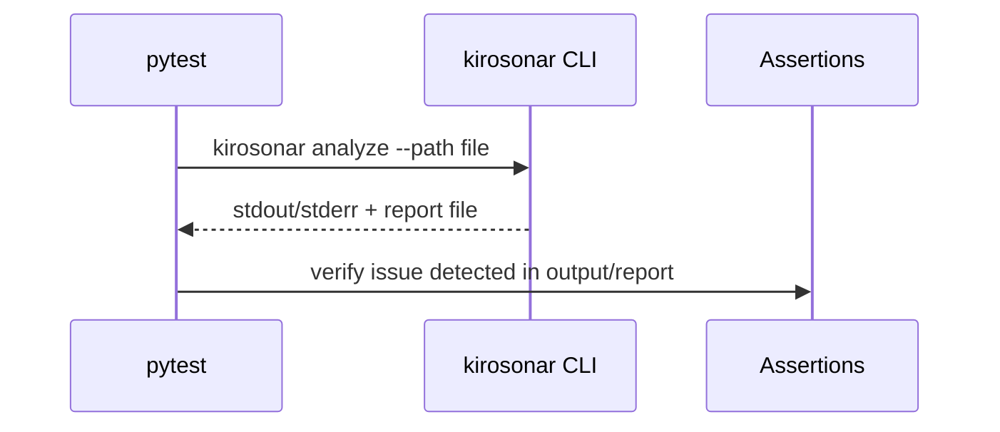

# Technical Design Document

## Overview

Este documento descreve o design técnico para a suite de testes de integração do KiroSonar com projetos JavaScript. A solução consiste em:

1. **Test_Project**: Um projeto JavaScript de exemplo em `backend/tests/js-project/` contendo erros intencionais detectáveis pelo SonarLint
2. **Test_Suite**: 10 testes de integração em pytest que validam a detecção de erros

A arquitetura segue o padrão existente do projeto.

## Architecture



### Fluxo de Execução dos Testes



## Components and Interfaces

### 1. Test Suite

**Localização**: `backend/tests/test_integration_js.py`

```python
"""Testes de integração do KiroSonar com projetos JavaScript."""

import pytest
from pathlib import Path


class TestDetection:
    """Testes para detecção de erros em JavaScript."""
    
    def test_detects_unused_variables(self):
        """Verifica que KiroSonar detecta variáveis não utilizadas."""
        ...
    
    def test_detects_unreachable_code(self):
        """Verifica que KiroSonar detecta código inalcançável."""
        ...

    # ... demais testes de detecção
```

### 2. KiroSonar CLI Integration

Os testes utilizam a CLI do KiroSonar via subprocess:

```python
import subprocess

def run_kirosonar_analyze(file_path: str, cwd: str = "backend") -> tuple[str, int]:
    """Executa kirosonar analyze em um arquivo.
    
    Args:
        file_path: Caminho do arquivo a analisar.
        cwd: Diretório de trabalho.
        
    Returns:
        Tuple de (output, return_code).
    """
    result = subprocess.run(
        ["python", "-m", "src.cli", "analyze", "--path", file_path],
        capture_output=True,
        text=True,
        cwd=cwd
    )
    return result.stdout + result.stderr, result.returncode
```

## Data Models

### Test Project Structure

```
backend/tests/js-project/
├── package.json
├── src/
│   ├── unused_vars.js      # Variáveis não utilizadas
│   ├── unreachable_code.js # Código após return
│   ├── duplicate_code.js   # Blocos duplicados
│   ├── security_issues.js  # eval(), vulnerabilidades
│   ├── code_smells.js      # Funções longas
│   ├── comparisons.js      # == vs ===
│   ├── console_logs.js     # console.log em produção
│   ├── global_vars.js      # Variáveis globais implícitas
│   ├── callback_hell.js    # Callbacks aninhados
│   └── error_handling.js   # try sem catch
└── README.md
```

### JavaScript Error Files Content

**unused_vars.js**:
```javascript
// SonarLint: Remove unused variable
function processData(input) {
    const unusedVar = "never used";
    const result = input * 2;
    return result;
}
```

**unreachable_code.js**:
```javascript
// SonarLint: Remove unreachable code
function calculate(x) {
    return x * 2;
    console.log("This never runs");
    const y = x + 1;
}
```

**security_issues.js**:
```javascript
// SonarLint: eval() is dangerous
function executeCode(code) {
    return eval(code);
}
```

**comparisons.js**:
```javascript
// SonarLint: Use === instead of ==
function checkValue(value) {
    if (value == null) {
        return false;
    }
    if (value == 0) {
        return false;
    }
    return true;
}
```

**console_logs.js**:
```javascript
// SonarLint: Remove console.log in production
function processOrder(order) {
    console.log("Processing order:", order);
    const total = order.items.reduce((sum, item) => sum + item.price, 0);
    console.log("Total:", total);
    return total;
}
```

**global_vars.js**:
```javascript
// SonarLint: Implicit global variable
function setConfig() {
    config = { debug: true };  // Missing let/const/var
    return config;
}
```

**callback_hell.js**:
```javascript
// SonarLint: Deeply nested callbacks
function fetchData(callback) {
    getData(function(data) {
        processData(data, function(processed) {
            saveData(processed, function(saved) {
                notifyUser(saved, function(notified) {
                    callback(notified);
                });
            });
        });
    });
}
```

**error_handling.js**:
```javascript
// SonarLint: Missing catch block
function parseJSON(text) {
    try {
        return JSON.parse(text);
    }
    // Missing catch block
}
```

## Correctness Properties

### Property 1: Issue Detection

*For any* JavaScript file containing a known SonarLint error pattern (unused variables, unreachable code, duplicate code, eval(), long functions, == comparisons, console.log, implicit globals, callback hell, or missing error handling), when KiroSonar analyzes the file, the output or report should contain a mention of the detected issue.

**Validates: Requirements 2.1, 3.1, 4.1, 5.1, 6.1, 7.1, 8.1, 9.1, 10.1, 11.1**

## Error Handling

### Test Execution Errors

| Error Condition | Handling |
|-----------------|----------|
| KiroSonar analysis fails | Test fails with descriptive message |
| Issue not detected | Test fails: "Expected issue not found in output" |
| Report file not created | Test fails: "Report file not found" |

## Testing Strategy

### Test Organization

```python
# backend/tests/test_integration_js.py

import pytest
import subprocess
from pathlib import Path

JS_PROJECT_PATH = Path(__file__).parent / "js-project" / "src"

def run_kirosonar_analyze(file_path: str) -> tuple[str, int]:
    """Executa kirosonar analyze em um arquivo."""
    result = subprocess.run(
        ["python", "-m", "src.cli", "analyze", "--path", file_path],
        capture_output=True,
        text=True,
        cwd=Path(__file__).parent.parent  # backend/
    )
    return result.stdout + result.stderr, result.returncode


class TestProjectStructure:
    """Unit tests for Test_Project structure (Requirement 1)."""
    
    def test_project_directory_exists(self):
        """Verify js-project directory exists at expected location."""
        ...
    
    def test_project_has_minimum_js_files(self):
        """Verify at least 10 JS files with distinct errors."""
        ...
    
    def test_package_json_exists_and_valid(self):
        """Verify package.json exists with valid JSON."""
        ...


class TestDetection:
    """Integration tests for error detection."""
    
    def test_detects_unused_variables(self):
        """Test kirosonar analyze detects unused variables."""
        file_path = JS_PROJECT_PATH / "unused_vars.js"
        output, code = run_kirosonar_analyze(str(file_path))
        
        # Verify detection in output (case-insensitive)
        assert any(term in output.lower() for term in ["unused", "não utilizada", "nunca utilizada"])
    
    def test_detects_unreachable_code(self):
        """Test kirosonar analyze detects unreachable code."""
        file_path = JS_PROJECT_PATH / "unreachable_code.js"
        output, code = run_kirosonar_analyze(str(file_path))
        
        assert any(term in output.lower() for term in ["unreachable", "inalcançável", "dead code"])
    
    def test_detects_duplicate_code(self):
        """Test kirosonar analyze detects duplicate code."""
        file_path = JS_PROJECT_PATH / "duplicate_code.js"
        output, code = run_kirosonar_analyze(str(file_path))
        
        assert any(term in output.lower() for term in ["duplicate", "duplicado", "repetido"])
    
    def test_detects_security_vulnerability(self):
        """Test kirosonar analyze detects eval() usage."""
        file_path = JS_PROJECT_PATH / "security_issues.js"
        output, code = run_kirosonar_analyze(str(file_path))
        
        assert any(term in output.lower() for term in ["eval", "security", "segurança", "vulnerab"])
    
    def test_detects_long_function(self):
        """Test kirosonar analyze detects long functions."""
        file_path = JS_PROJECT_PATH / "code_smells.js"
        output, code = run_kirosonar_analyze(str(file_path))
        
        assert any(term in output.lower() for term in ["long", "longa", "complexa", "lines", "linhas"])
    
    def test_detects_loose_equality(self):
        """Test kirosonar analyze detects == instead of ===."""
        file_path = JS_PROJECT_PATH / "comparisons.js"
        output, code = run_kirosonar_analyze(str(file_path))
        
        assert any(term in output.lower() for term in ["===", "strict", "equality", "igualdade"])
    
    def test_detects_console_log(self):
        """Test kirosonar analyze detects console.log."""
        file_path = JS_PROJECT_PATH / "console_logs.js"
        output, code = run_kirosonar_analyze(str(file_path))
        
        assert any(term in output.lower() for term in ["console", "log", "debug"])
    
    def test_detects_implicit_global(self):
        """Test kirosonar analyze detects implicit global variables."""
        file_path = JS_PROJECT_PATH / "global_vars.js"
        output, code = run_kirosonar_analyze(str(file_path))
        
        assert any(term in output.lower() for term in ["global", "let", "const", "var", "declaração"])
    
    def test_detects_callback_hell(self):
        """Test kirosonar analyze detects deeply nested callbacks."""
        file_path = JS_PROJECT_PATH / "callback_hell.js"
        output, code = run_kirosonar_analyze(str(file_path))
        
        assert any(term in output.lower() for term in ["callback", "nested", "aninhado", "async", "promise"])
    
    def test_detects_missing_error_handling(self):
        """Test kirosonar analyze detects missing catch block."""
        file_path = JS_PROJECT_PATH / "error_handling.js"
        output, code = run_kirosonar_analyze(str(file_path))
        
        assert any(term in output.lower() for term in ["catch", "error", "erro", "exception", "try"])
```

### Test Execution

```bash
# Run all integration tests
pytest backend/tests/test_integration_js.py -v

# Run with coverage
pytest backend/tests/test_integration_js.py --cov=src --cov-report=html
```
